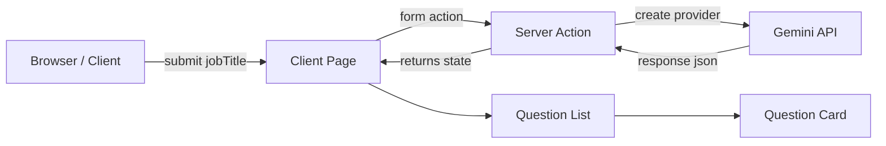

**Melo Screening — AI Interview Question Generator**

A small Next.js app that generates three role-specific screening interview questions using a Server Action and the Gemini (Google) generative model via the Vercel AI SDK.

**Quick Start**

- Install dependencies:

```bash
npm install
```
- Run the development server:

```bash
npm run dev
```
- Open http://localhost:3000 in your browser.

**Required environment**

- Add your Gemini API key to `.env.local`:

```bash
GEMINI_API_KEY=your_api_key_here
```

If `GEMINI_API_KEY` is missing the app will show a configuration alert (see [app/actions.ts](app/actions.ts)).

**What this repo contains**

- Client page and layout: [app/page.tsx](app/page.tsx) and [app/layout.tsx](app/layout.tsx)
- Server Action that calls the generative model: [app/actions.ts](app/actions.ts)
- UI components: [components/Hero.tsx](components/Hero.tsx), [components/SuggestionTags.tsx](components/SuggestionTags.tsx), [components/QuestionList.tsx](components/QuestionList.tsx), [components/QuestionCard.tsx](components/QuestionCard.tsx), [components/SkeletonLoader.tsx](components/SkeletonLoader.tsx), [components/StatusAlert.tsx](components/StatusAlert.tsx)

**Architecture (high level)**



This shows the main runtime flow: the client submits a form bound to a Server Action, the Server Action calls the generative API, validates and returns structured question objects, and the client renders them using the component tree.

**Component map**

- `Hero` — typographic header on the left panel ([components/Hero.tsx](components/Hero.tsx)).
- `SuggestionTags` — quick-select job titles that auto-submit the form ([components/SuggestionTags.tsx](components/SuggestionTags.tsx)).
- `QuestionList` — renders a list of `QuestionCard` components ([components/QuestionList.tsx](components/QuestionList.tsx)).
- `QuestionCard` — interactive card that shows question text and expandable rationale/ideal answers ([components/QuestionCard.tsx](components/QuestionCard.tsx)).
- `SkeletonLoader` — loading placeholders shown while the Server Action is pending ([components/SkeletonLoader.tsx](components/SkeletonLoader.tsx)).
- `StatusAlert` — displays setup errors such as a missing `GEMINI_API_KEY` ([components/StatusAlert.tsx](components/StatusAlert.tsx)).

**Server Action / AI integration**

- The Server Action is implemented in [app/actions.ts](app/actions.ts) and uses:
	- `generateText` from the `ai` package with `Output.object(...)` for structured output validation.
	- `createGoogleGenerativeAI` from `@ai-sdk/google` to wire the provider using `GEMINI_API_KEY`.
	- `zod` for input validation (`jobTitle`) and output schema validation for each question item.

Important notes:
- The Server Action validates the job title and returns clear error messages when the API key is missing or the AI call fails.
- The action expects the model output to match the `QuestionsArraySchema` defined in the file.

**Files to inspect for behavior/debugging**

- [app/actions.ts](app/actions.ts) — the core Server Action and AI integration.
- [app/page.tsx](app/page.tsx) — main client page, form binding, and UI orchestration.
- [components/QuestionCard.tsx](components/QuestionCard.tsx) — copy, accordion UI and local state.

**Deploy**

- This app is compatible with Vercel. Ensure `GEMINI_API_KEY` is set in your Vercel project environment variables before deploying.

**Contributing / Extending**

- To change the question generation behavior, edit the prompt and the output schema in [app/actions.ts](app/actions.ts).
- To support more questions or different formats, update the `QuestionsArraySchema` and adjust the UI in `QuestionList` / `QuestionCard`.

